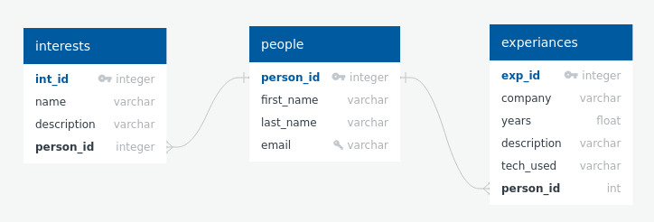

# Example FastAPI Project

This is an example FastAPI project. This project is far from a complete product but hopes to provide insights into my 
coding ability, use of the framework, and ability to learn new technologies quickly.

The project provides simple post and get endpoints for a "person". Each person object can have multiple
"experiences"(job experience) and multiple "interests". The person may be created and then interests and experiences may 
be added by making subsequent post calls.

## Installation and Running

On the command line in the project root run the following command to install the project requirements.
Make sure to use a virtual environment if you do not wish to install these requirements on your native 
instance:

```commandline
pip install -r requirements.txt
```

After all requirements are installed you can start the application by running this command:

```commandline
uvicorn app.main:app --reload
```

The application should now be running at `localhost:8000`.

Calling get (or visiting in a browser) `localhost:8000` will display a short welcome message

## Documentation

With the application running documentation for the api can be found at `localhost:8000/docs`

The documentation is interactive and end points can be used from here by clicking the "Try it out" button and 
providing the required fields.

Additionally, these endpoints can be called through any other request method.


## Tests

The applications tests can be run by running:

```commandline
pytest
```
at the application root.

## Technologies Used

This project is written in Python and uses the [FastAPI](https://fastapi.tiangolo.com/) framework. It uses
sql [Pydantic](https://pydantic-docs.helpmanual.io/) models
for validation and [SQLalchemy](https://www.sqlalchemy.org/) for as an ORM interacting with the database. 

The database is [SQLite](https://www.sqlite.org/index.html) backed by a file.

Tests were written using [Pytest](https://docs.pytest.org/en/7.1.x/). It should be noted that the test setup in 
`tests/conftest.py` was taken and adapted form [this tutorial](https://www.fastapitutorial.com/blog/unit-testing-in-fastapi/).


## Database Diagram



## Next Steps / Things to do

This project was created to provide a quick example and is not intended to be a 100% complete project and application.
If work continues on this project here are several things that either should or could be done.

- Write additional tests for all endpoints and functions to have more complete test coverage
- Create additional endpoints to make API more robust including delete, update(put), and additional get endpoints.
- Connect to a more production ready database such as PostgresSQL and ensure safe and appropriate connection parameters
- Implement Alembic for database migrations ensuring ORM models and database schemas stay in sync.
- Project structure could use some re-organizing.
- Add additional comments
- Add security
- Containerize project